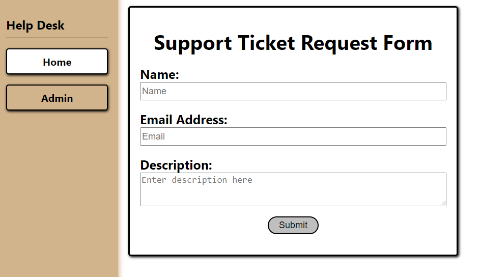
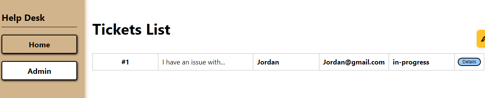
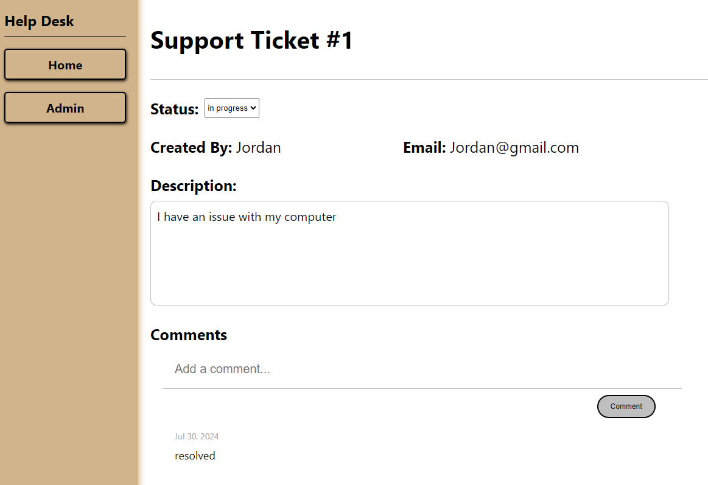

# Zealthy Help Desk Application
Zealthy is a web-based help desk application designed to manage support tickets efficiently. The application features a React frontend and a Flask backend, utilizing a PostgreSQL database for data storage.

## Features
- Admin dashboard for ticket overview
- Create, view and update support tickets
- Create comments on support tickets

## Setup

### Frontend Setup

Navigate to the react-app directory:

        cd react-app
        npm install
        npm start

### Backend Setup

        cd ..
        python -m venv venv

For window

        venv\Scripts\activate

For mac/linux

        source venv/bin/activate

Install dependencies

        pip install -r requirements.txt
        flask run

## Tickets

- GET /tickets/ - Get all tickets
- POST /tickets/ - Create a new ticket
- GET /tickets/:id - Get ticket by ID
- PUT /tickets/:id - Update ticket by ID
- DELETE /tickets/:id - Delete ticket by ID

### Ticket Form

### Ticket List

### Ticket Details

## Comment

- GET /tickets/:id/comments - Get all tickets
- POST /tickets/:id - Create a new ticket

